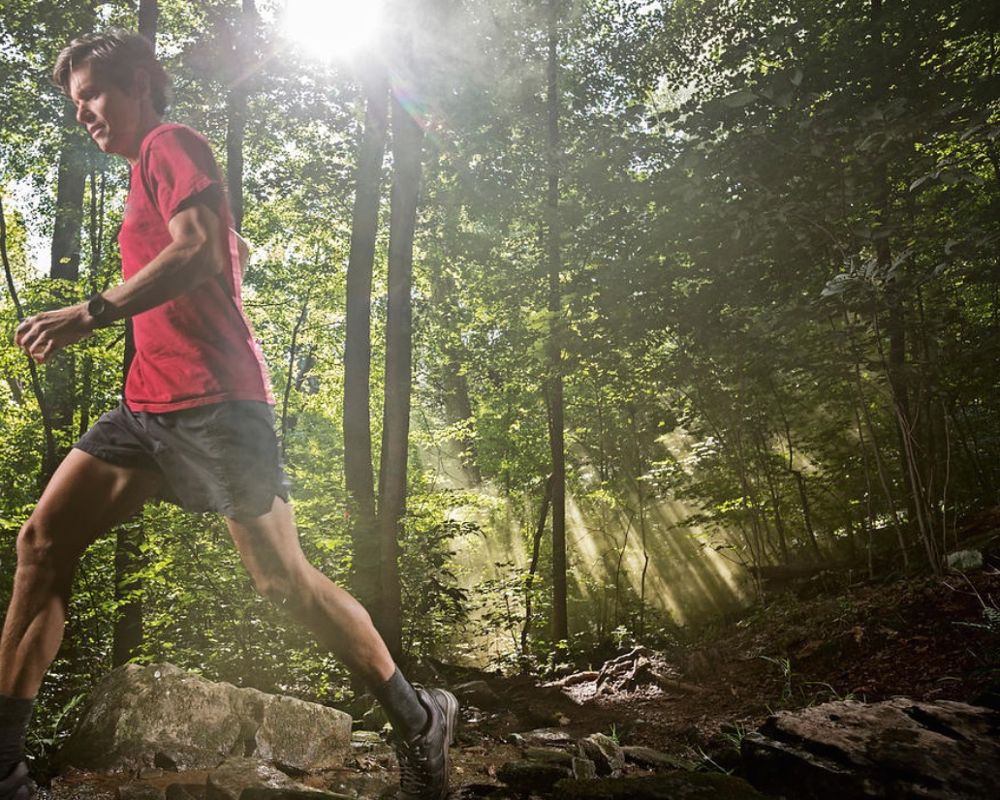

# Sewanee Trail Data

A collection of trail data for the Domain in various formats.

After editing, correcting, and enhancing the trail data provided by Sewanee's
[Landscape Analysis Lab](http://lal.sewanee.edu), we'd like to use it as the basis for a simple, interactive guide to publicly-accessible trails on the Domain.

This will give us a chance to explore the [Open Trails](http://www.opentraildata.org) specification and the newly-released [Mapbox Studio](https://www.mapbox.com/mapbox-studio/).

## See Also

* [Domain-related geodata collections](http://arcgis.sewanee.edu:6080/arcgis/rest/services) curated by the LAL

* [Sewanee Campus on OSM](http://www.openstreetmap.org/#map=16/35.2072/-85.9159&layers=QND)
    * [in 3D](http://osmbuildings.org/gl/?lat=35.20450&lon=-85.91958&zoom=17.00&rotation=-20&tilt=30)

