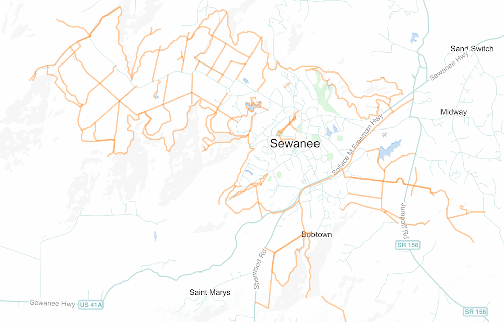

# Trail Data

This directory contains the trail geodata provided by the Landscape Analysis Lab.

* `shapefile.zip` - the original [shapefile archive](https://en.wikipedia.org/wiki/Shapefile) provided by the LAL
* `trails.kmz` - trail data in [kmz format](https://en.wikipedia.org/wiki/Keyhole_Markup_Language)

* [`shapefile/`](shapefile) - individual files in the shapefile archive
* [`geojson/`](geojson) - trail data converted into [geojson](https://en.wikipedia.org/wiki/GeoJSON) format
* [`open-trails/`](open-trails) - trail data converted into [OpenTrails](http://www.opentraildata.org) format
